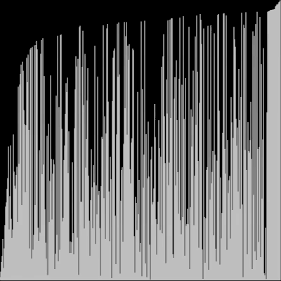

# Bubble Sort (Sinking Sort)
## Explanation
* Bubble sort, sometimes referred to as sinking sort, is a simple sorting algorithm that repeatedly steps through the list, compares adjacent pairs and swaps them if they are in the wrong order. The pass through the list is repeated until the list is sorted. 

* Best case: Ω(n)
* Worst case: Θ(n^2)

# Resources:
* https://en.wikipedia.org/wiki/Bubble_sort
* https://www.algorithmist.com/index.php/Bubble_sort

### The visualization of the sort can be done with Javascript's p5.js library or with Processing

