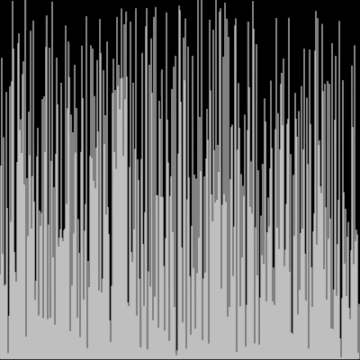

# Insertion Sort
## Explanation
1. Work from left to right
2. Examine each item and compare it to items on its left
3. Insert the item in the correct position in the array

* Best case: Ω(n)
* Worst case: Θ(n^2)

# Resources:
* https://en.wikipedia.org/wiki/Insertion_sort
* https://www.youtube.com/watch?v=JU767SDMDvA

### The visualization of the sort can be done with Javascript's p5.js library or with Processing

