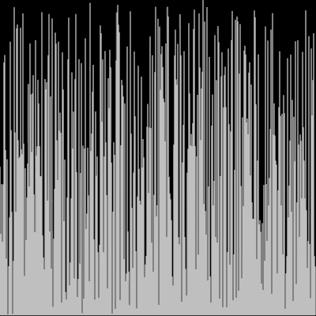

# Selection Sort
## Explanation
* The algorithm proceeds by finding the smallest (or largest, depending on sorting order) element in the unsorted sublist, exchanging (swapping) it with the leftmost unsorted element (putting it in sorted order), and moving the sublist boundaries one element to the right

* Best case: Ω(n^2)
* Worst case: Θ(n^2)

# Resources:
* https://en.wikipedia.org/wiki/Selection_sort
* https://www.algorithmist.com/index.php/Selection_sort
* https://www.youtube.com/watch?v=g-PGLbMth_g
* https://www.youtube.com/watch?v=Ns4TPTC8whw (fun dancing video)

### The visualization of the sort can be done with Javascript's p5.js library or with Processing

